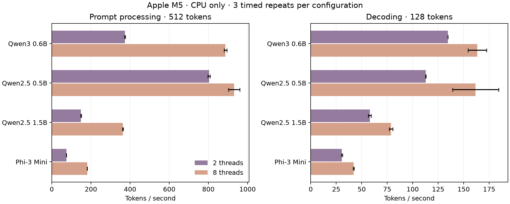

# Four-model testing and performance report

September 13, 2026. Local hardware: Apple M5, 10 logical CPUs, 24 GiB RAM. Native measurements use the CPU backend. These are execution, proof-verification and resource tests; they do not score answer quality.

The expanded tests found five implementation problems, which were fixed and retested. The original failures are preserved below. The largest measured costs are trace capture and complete-operation proving, rather than verification.

## What ran

| Suite | Scope | Result |
|---|---|---|
| Initial native matrix | Four models, 12 prompts, 2/8 threads, repeated seeds, greedy and temperature 0.7; 208 fresh generation attempts | 204 passed; four Phi-3 Unicode receipt failures |
| Initial consistency checks | Checks on successfully generated receipts | 204 content checks, 102 exact repeats and 102 bit-exact replays passed |
| Post-fix native regression | All 12 prompts on four models, plus repeated Unicode cases at both thread counts | 60/60 generations and content checks, 52 replays and eight repeats passed |
| Native UTF-8 boundaries | 19 byte sequences, each honest and tampered | 38 checks passed |
| Sustained throughput | Four models, two thread counts, prompt lengths 32/128/512 and decode lengths 32/128 | 40 configurations, 120 timed samples after warmup |
| Registered row proofs | Two models, three prompts each; K=1024,1536,2048,3072; three separated groups per case | 18 fresh exported proofs accepted; 18 changed-group files and 18 changed-sum checks rejected |
| Complete F20 operation | Three normalized input embeddings, all 1,024 rows, 65 component proofs per input | 195 fresh component proofs; three packages accepted; 36 rejection controls passed |
| Native negative controls | Honest receipts, changed text/prompt/version/token/per-token record, different model file | Four honest controls accepted; 24 mutations rejected |
| Verifier stress | Seeded altered proof attempts and honest recovery checks | 3,000 mutations and seven malformed cases rejected; 120 honest checks accepted |
| Circuit witnesses | Actual compiled circuits at quantization, signed extrema, tie and rounding boundaries | Eight valid and nine invalid witness calculations behaved as expected; four R1CS checks passed |
| Registration and isolation | Recompute complete-operation commitments; verify with model/repository/network access denied | All 64 weight-and-scale commitments matched; permission-denial controls and verification passed |
| API and existing regressions | Actual local generation, download and independent verification; full local regression command | Passed, including all 40 prototype tests |

Counts refer to different layers of testing and should not be added into a single “test count.” The stress cases are mutation attempts, not necessarily 3,000 distinct payloads. The independent commitment recomputation was performed by the same contributor; it is not a second registrar or a ceremony audit.

The public [corpus](../../corpus.json) includes factual, arithmetic, code, JSON, Spanish, Chinese, Arabic, combining characters/emoji, whitespace, HTML-like text, repetition and longer requests. The generation matrix requests eight steps, with context 1,024, batch 512 and seed 17. The throughput suite separately measures sustained native execution. Native receipt checks cover all four models; registered row proofs cover only the two registered proof models. Phi-3 has no trusted proof registration in this project.

## Speed and memory

Eight-thread CPU measurements, with three throughput samples per configuration:

| Model | Decode, 128 tokens (tokens/s) | Prompt, 512 tokens (tokens/s) | Peak process RSS during throughput (GiB) | Median fresh receipt generation after fix (s) |
|---|---:|---:|---:|---:|
| Qwen3 0.6B Q4_K_M | 163.38 | 887.32 | 0.92 | 2.32 |
| Qwen2.5 0.5B Q4_K_M | 161.74 | 931.52 | 0.78 | 2.72 |
| Qwen2.5 1.5B Q4_K_M | 78.85 | 362.90 | 2.02 | 5.21 |
| Phi-3 Mini Q4_0 | 42.13 | 181.41 | 4.33 | 10.71 |

Throughput excludes loading, tokenization, sampling and receipt creation. Receipt latency includes those costs and mixes prompt lengths. The RSS profile spans five throughput configurations and warmups, so it is not the memory requirement of a single 128-token decode. Different architectures, sizes and quantizations make this a comparison of these files, not a controlled model-family ranking.

Error bars show one sample standard deviation across three timed repetitions. All 40 configurations, CPU seconds and average occupied cores are in [the extended tables](extended.md). More threads helped sustained decoding in these runs, but did not consistently improve short prompt processing or fresh receipt latency.

Registered row-group proving took **2.81–3.81 seconds per group**. The six paired capture runs produced identical token sequences with and without tracing. Qwen3 traces occupied **1,420–1,539 MiB**, with **12.06–12.81 seconds** of observed additional capture time. Qwen2.5 1.5B traces occupied **441–610 MiB**, adding **3.86–5.10 seconds**. Tracing always ran second, with uncontrolled filesystem cache; this is observed end-to-end overhead, not an isolated serialization measurement. The whole row-proof runner, including Python trace parsing, reached **6.22 GiB summed RSS**.

The three complete F20 operations took **270.57–274.25 seconds each**, with **227.85–231.32 seconds** spent generating the 65 component proofs. In-process package verification took **459–475 ms**; each public package is approximately **69.6 kB**. Peak individual process RSS was **2.72–2.78 GiB**. These packages prove one matrix operation, not an entire inference; input embedding preparation remains outside the proof, and the website does not accept this separate experimental claim.

The stress test completed in **11.2 seconds** of measured command time with approximately **0.91 GiB** peak process-tree RSS. Its raw memory samples show resident memory growing during repeated verification, then staying near that level toward the end. This short run does not establish bounded memory use over an indefinitely running service; a longer memory soak remains useful.

## Bugs found and fixed

1. **Partial UTF-8 output crashed receipt creation.** All four initial failures were Phi-3 stopping inside a character. Generation and content verification now concatenate token bytes before applying the same replacement-character display policy. Exact token IDs remain unchanged. The original failing configurations pass in the 60-case rerun, and 38 byte-boundary checks cover complete, partial and malformed encodings.
2. **Invalid Unicode reached a background API job.** A lone surrogate now receives HTTP 400 before a job starts. Both the API matrix and the restarted local server exercised this rejection.
3. **Installation assumed quantization was byte-identical across CPUs.** Linux CI exposed a mismatch with the registered file. Setup now downloads the exact registered GGUF and authenticates its size and SHA-256. Clean Linux installation, actual API generation and independently verified fresh proofs now pass in CI. Source-model and quantization provenance remain recorded.
4. **A research timeout could leave the prover running.** Terminating the timing wrapper did not terminate its child. The driver now owns and cleans up the full process group; a real descendant-process regression verifies this behavior.
5. **Decorative graphics competed with verification on slower browsers.** The animation now pauses while verification is active, preserving the user's pause preference. Browser assertions also allow slower machines more time. Since both changed, these runs do not isolate the animation change's performance effect.

The native repair is in fork commit `a751319930c824eb9cbb24a7c91c4a6ba18ac679`; the parent repository and setup release pin that revision. Benchmark/test repairs also removed a resource-monitor completion delay, fixed fast-process observation races, made prerequisite tests independent of local builds, and rejected empty benchmark selections. These are not counted as additional model failures.

## CI/CD coverage

The deployment gate now runs seven check jobs: Linux/macOS with Node 22/24; native Linux setup, receipt checks, actual API generation and fresh row proofs; actual circuit witness boundaries; and browser tests in Chromium, Firefox, WebKit and mobile Chromium emulation. The browser suite has **40 scenarios**, including proof uploads for both registered proof models and all four circuit widths, invalid-file recovery, input limits, safe rendering, keyboard operation, mobile layout, reduced motion and missing WebGL.

All checks must pass before the public verifier builds and deploys. Actions and dependencies are pinned. Public results, coverage and browser failure traces are retained as CI artifacts; private traces and witnesses are excluded. Report-only pushes do not redeploy an unchanged verifier. Pull requests still run the checks. The final run status and source revision are recorded in [ci.json](ci.json).

[Browser timing samples](browser.json) record page-reported policy/pairing time separately from test interaction time. They come from GitHub's virtual Ubuntu runner, not this M5; mobile emulation is not a physical phone. They should not be read as a controlled browser ranking.

Combined local Python instrumentation reports **72.1% statement coverage and 62.5% branch coverage** (69.8% combined). The local prover module reaches 88.7% statements and 86.5% branches. The [coverage report](coverage.json) includes untested release-preparation code and partially covered installer code; it excludes C++ and JavaScript. Clean-install CI adds behavioral evidence but is not included in these local percentages. No whole-project coverage percentage is claimed.

## Reproduction and limits

Use the commands and locked environment in [the benchmark guide](../../README.md). The [60-case regression plan](../../unicode-regression-plan.json) reproduces the post-fix matrix. Raw records include model digests, binary identity, execution settings and resource samples. The initial baseline used a development binary whose build header reported `7bf600953`; its binary digest was captured before rebuilding. It should not be described as a clean release build. Later runs record the repaired native revision and source/material identities.

Heavy local suites ran sequentially. Discarded pilot runs included an incorrectly configured replay backend and interrupted overlapping orchestration; those directories are excluded from every published aggregate. All 208 initial matrix attempts, including the four genuine failures, are retained. The post-fix regression is a targeted 60-case rerun, not a second complete 208-case sweep.

OS timing provides wall time, CPU time and peak process RSS; 50 ms sampling tracks command descendants, and a separate 100 ms observer tracks the complete runner including trace parsing. Summed RSS can double-count shared pages and sampling can miss brief peaks. The whole-runner observer began partway through the Unicode regression, before the later suites. System swap and available memory include other applications and cannot be attributed to the benchmark. Filesystem cache was uncontrolled; no cold-cache, GPU/Metal, physical-phone, Windows, energy or thermal-throttling results are claimed.

Phi-3's loader warned about disabled sliding-window attention and corrected control-token metadata. This report does not certify model quality, instruction following, multilingual correctness, or long-context behavior. Exact repeat/replay results apply to the tested CPU configurations, not arbitrary backends. The finite mutation suite is regression evidence, not a cryptographic soundness proof. The existing experimental setup and partial proof scopes remain unchanged.

## Evidence and next experiments

- [Initial native results and failures](baseline/native.md), [chart](baseline/native.png), [raw records](baseline/native-results.jsonl.gz).
- [Post-fix native results](postfix/native.md), [chart](postfix/native.png), [raw records](postfix/native-results.jsonl.gz).
- [Extended performance/resource tables](extended.md), [throughput records](throughput.json.gz), [whole-runner samples](process-tree.jsonl.gz).
- [Row-proof records](rows/results.jsonl.gz) and [18 public proof packages](rows/proofs/).
- Complete-operation packages, measurements, registries and rejection controls: [token 0](operations/token-0/), [token 198](operations/token-198/), [token 512](operations/token-512/).
- [Stress results](stress-results.json), [native negative controls](native-negative-controls.json.gz), [local regression output](local-regressions.txt), [witness boundaries](witness-boundaries.txt), [registration recomputation](independent-registration.txt), [isolated verification](isolated-verification.txt).
- [SHA-256 inventory](SHA256SUMS.json) covers every other file in this report directory. It detects accidental archive changes; it is not an external signature.

The measurements favor three next experiments: capture only the operation needed for a proof to avoid the full trace; reuse authenticated model state to reduce fresh-process startup costs; and compare proof backends on the complete operation before expanding to a full token. Longer browser memory soaks and clean CPU/GPU baselines should precede hard performance budgets. The test infrastructure now makes those comparisons repeatable.
